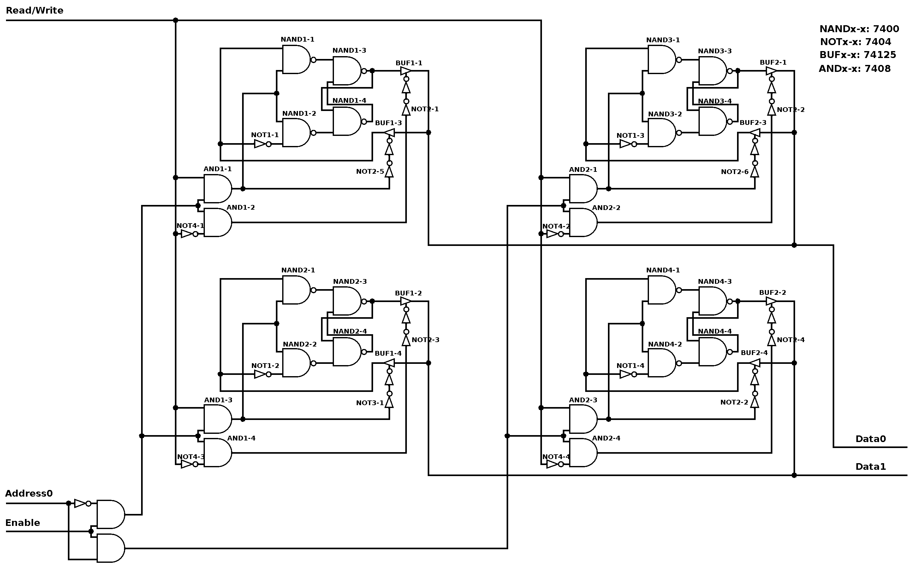

# Lab work : 4-bit Memory Block
Author: <a href="https://github.com/bogdanmagometa">Bohdan Mahometa</a>  
Variant: 2x2 (2 words, 2 bits each)

### Task

Create 2x2 memory block.

The memory block should have 1 input for choosing address, 1 for enable and 1 for choosing mode (Read/Write).

Both reading from and writing to the memory block should happen through Data0 and Data1.
The value on Read/Write input decides whether the Data pins are outputs or inputs.

The Address0 input chooses on which word to perform operations (reading or writing).

When Enable is low, the memory block ignores the values on other input pins and Data pins are disconnected.

### Important!

The two NOTs connected sequentially on the functional schematic are not my mistake. One of them is a part of the buffer with inverted control input. It just happened that I couldn't find the 3-state buffer with not inverted enable.

### Results

#### The schematic of the memory block:

  

#### The memory block based on 7400-series ICs:

